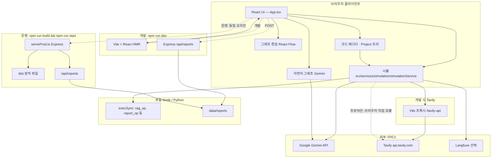

<div align="center">

</div>

# AgentFlow

워크플로우 그래프를 캔버스에서 편집하고, 자연어로 그래프를 생성·수정하며, 노드별 코드와 시뮬레이션(RAG·라우터·보고서 등)을 한 화면에서 다루는 로컬 웹 앱입니다.

---

## 주요 기능

| 영역 | 설명 |
|------|------|
| 그래프 에디터 | React Flow 기반 2D / 3D 뷰, 노드·엣지 편집, 팀 그룹 등 |
| AI 빌더 | Gemini로 자연어 → 워크플로 JSON 반영(후처리로 라우터→종료 보완 등) |
| 코드 탭 | 캔버스와 동기화된 `Project/graph.py`(LangGraph 스켈레톤), `agents/`·`tools/` 등 노드 스크립트 |
| 내보내기 | 코드 탭에서 프로젝트 전체 ZIP 다운로드(`README.md`, `requirements.txt`, 편집한 `.py` 포함) |
| 시뮬레이션 | 노드 타입별 실행: 로컬 Python 스크립트 우선, 브라우저/제약 시 Gemini·Tavily 등 폴백 |
| 보고서·스토리지 | 보고서 아카이브, Express API로 디스크 저장(개발/운영 공통 패턴) |

도메인 규칙(노드 타입, 스킬 ID, RAG 인덱싱/질의 두 갈래)은 [`.cursor/skills/agentflow-workflow/SKILL.md`](./.cursor/skills/agentflow-workflow/SKILL.md)와 [`dev_docs/`](./dev_docs/)가 기준입니다.

---

## 아키텍처 개요

브라우저·개발·운영 서버·외부 API·로컬 실행이 어떻게 연결되는지 요약합니다.



- 개발: Vite가 UI를 띄우고, 같은 프로세스에 보고서 API가 붙습니다.  
- 운영: 빌드된 정적 파일 + 동일 보고서 API.  
- Tavily: 개발 중에는 Vite 프록시로 CORS 우회, 프로덕션 빌드에서는 클라이언트가 `api.tavily.com`을 직접 호출합니다.

---

## 소스 디렉터리(요약)

| 경로 | 역할 |
|------|------|
| `src/App.tsx` | 앱 루트, 레이아웃 연결 |
| `src/components/` | UI 컴포넌트(캔버스, 사이드바, 코드 탭 등) |
| `src/hooks/` | `app/`, `graph/`, `simulation/`, `gemini/`, `project/`, `ui/` |
| `src/services/` | `simulation/`, `gemini/`, `agent/` — 시뮬·LLM·에이전트 어댑터 |
| `src/lib/` | `graph/`, `project/`, `simulation/`, `report/`, `prompts/` 등 순수 로직 |
| `src/constants.ts` | 노드·스킬 레지스트리 등 단일 출처 |
| `server/` | 개발/운영 Express(보고서 라우트 등) |
| `dev_docs/` | RAG·플로우 보조 문서 |

타입 검사만 돌릴 때: `npm run lint`

---

## 화면에서 노드 추가하기 (앱 사용)

앱을 띄운 뒤(`npm run dev`) 다음 방법으로 캔버스에 노드를 둘 수 있습니다.

1. **Palette 탭**  
   왼쪽 사이드바에서 **Palette**를 연 다음, 섹션별 카드(AI Agent, Database, Data Import 등)를 **클릭**하면 새 노드가 그래프에 추가됩니다. 구현: `src/components/misc/Sidebar.tsx`의 `NodePalette`, `onAddNode` 콜백.

2. **Nodes 탭에서 드래그 앤 드롭**  
   **Palette** 탭의 노드 그리드에서 타일을 **캔버스(React Flow 영역)로 드래그**해 놓으면 해당 타입 노드가 드롭 위치에 생성됩니다. `onDragStart` → `onDrop` → `createPaletteDroppedNode` 흐름은 `src/hooks/graph/useWorkflowGraphMutations.ts`, `src/lib/graph/createPaletteDroppedNode.ts`를 따릅니다.

3. **엣지로 연결**  
   노드의 연결 핸들을 드래그해 다른 노드와 잇습니다(`onConnect`).

4. **AI Builder**  
   **AI Builder** 탭에 자연어로 흐름을 설명하면 Gemini가 `nodes` / `edges` JSON을 만들고 그래프에 반영됩니다(`src/lib/prompts/geminiPrompts.ts`, `src/services/gemini/geminiAppServices.ts`).

**참고:** Palette 클릭으로 넣는 타입과, Nodes 탭 드래그 목록에 있는 타입이 완전히 같지 않을 수 있습니다(예: RAG용 `ingest`·`chunk` 등은 코드·AI 빌더 위주). 새 타입을 **두 UI 모두**에서 쓰려면 아래 「코드로 노드 타입 추가」를 같이 적용하세요.

---

## 코드로 노드 타입 추가하기

새 `type`을 end-to-end로 넣을 때는 보통 아래를 순서대로 맞춥니다.

| 단계 | 파일 / 위치 | 할 일 |
|------|----------------|--------|
| 1 | `src/types.ts` | `Node`의 `type` 유니온에 문자열 추가 |
| 2 | `src/lib/graph/createPaletteDroppedNode.ts` | 드롭 시 기본 `label`·`config` 분기 추가 |
| 3 | `src/components/misc/Sidebar.tsx` | `NodePalette`에 `NodePaletteItem` + `onAddNode('새타입', '라벨', optionalConfig)` |
| 4 | `src/components/sidebar/NodesTabPanel.tsx` | 「드래그하여 노드 추가」배열에 `{ type, label, icon, color }` 추가; 노드 상세·리스트의 타입별 아이콘 분기에 동일 타입 처리 |
| 5 | `src/lib/ui/utils.ts` | `getNodeColor`에 `case` 추가(없으면 기본 회색) |
| 6 | `src/services/simulation/simulationService.ts` | `executeNode`의 `switch (type)`에 동작 분기 |
| 7 | `src/lib/project/nodeCodePaths.ts` 등 | 코드 탭·보내기와 맞물리면 경로·스텁 생성 로직 보강 |
| 8 | `src/lib/prompts/geminiPrompts.ts` | AI 빌더 JSON 규칙의 노드 `type` 나열에 새 타입 포함 |
| 9 | 설정 UI | `NodesTabPanel`(또는 `NodeConfigPanel.tsx`를 쓰는 화면)에 해당 타입 전용 `config` 필드가 필요하면 조건부 폼 추가 |

시뮬레이션·보내기·RAG 등 기존 패턴은 `database`, `datasource`, `chunk` 등 구현을 참고하면 됩니다.

---

## 스킬(skills) 추가하기

스킬은 **노드 메타데이터 + AI 빌더·헬퍼 프롬프트**의 단일 목록으로 쓰입니다.

1. **`src/constants.ts`의 `SKILLS_REGISTRY`**  
   배열에 `{ id, name, description }` 객체를 하나 추가합니다. `id`는 저장된 그래프와 호환을 위해 한 번 정하면 바꾸지 않는 것이 좋습니다.

2. **프롬프트 자동 반영**  
   `getSkillsPromptBlock()`이 `SKILLS_REGISTRY`를 그대로 나열하므로, AI 빌더(`geminiPrompts.ts`)·에이전트 헬퍼에 **별도 목록을 중복 작성할 필요는 없습니다**. 다만 새 스킬에 맞춰 **NL 생성 규칙**(예: 「이런 요청이면 이 스킬을 붙여라」)을 `src/lib/prompts/geminiPrompts.ts` 규칙 번호에 추가하는 것은 권장합니다.

3. **노드 JSON**  
   AI 빌더 스키마상 각 노드는 루트에 `"skills": ["스킬_id", ...]` 배열을 둘 수 있습니다(`geminiPrompts.ts` 참고).

4. **에이전트 시뮬레이션**  
   `agent` 노드 실행 시 `Agent`에 넘기는 스킬은 현재 **`node.config.skills`**를 읽습니다(`simulationService.ts`). AI가 만든 그래프가 루트 `node.skills`만 채우는 경우, 시뮬과 맞추려면 `config.skills`와 동기화하는 처리를 추가하거나, 생성 프롬프트에서 agent의 `config` 안에 `skills`를 넣도록 안내하는 편이 안전합니다.

5. **Cursor / 저장소 가이드**  
   에디터 AI가 프로젝트 규칙을 읽게 하려면 `.cursor/skills/agentflow-workflow/SKILL.md`에 새 스킬 ID와 노드 매핑을 짧게 적어 두면 좋습니다.

자연어 워크플로 문서는 [`dev_docs/natural-language-workflow/06-skills.md`](./dev_docs/natural-language-workflow/06-skills.md)를 참고하세요.

---

## 로컬 실행

필수: Node.js (권장 LTS)

1. 의존성: `npm install`
2. 환경 변수: 프로젝트 루트에 `.env` 또는 `.env.local`을 두고 [`.env.example`](./.env.example)에 나온 이름을 참고해 설정합니다. 실제 비밀 값은 저장소에 커밋하지 마세요.
3. 개발 서버: `npm run dev` — 기본 [http://localhost:3000](http://localhost:3000) (호스트 `0.0.0.0`)

프로덕션 빌드 후 실행

```bash
npm run build
npm run start
```

포트는 환경 변수 `PORT`(미설정 시 3000).

---

## 코드 에디터와 ZIP 내보내기

- 캔버스나 AI 빌더로 그래프가 바뀌면 `Project/graph.py`가 같은 내용으로 갱신됩니다(다른 노드 파일을 보고 있을 때는 포커스만 그대로일 수 있음).
- 코드 탭의 「내보내기(ZIP)」 또는 에디터 도구 모음의 저장 아이콘으로 `Project/` 전체를 ZIP으로 받을 수 있습니다.
- ZIP 안 `README.md`에 Python 가상환경·`pip install -r requirements.txt`·`python graph.py` 실행 순서가 정리되어 있습니다.
- 내보낸 코드는 LangGraph 스켈레톤 + 노드 스텁 중심입니다. 실서비스와 동일 동작을 위해서는 API 키, DB, MCP 엔드포인트 등을 각 스크립트에 맞게 조정해야 합니다.

---

## 선택 환경 변수(요약)

| 이름 | 용도 |
|------|------|
| `GEMINI_API_KEY` | NL 빌더, 시뮬 폴백, 에이전트 |
| `TAVILY_API_KEY` | Tavily 검색 노드 |
| `AF_REPORTS_DIR`, `AF_REPORT_API_SECRET`, `VITE_AF_REPORT_API_SECRET` | 보고서 디스크 경로·API 보호 |
| `VITE_LANGFUSE_*` | Langfuse 트레이스(선택) |
| `AF_TAVILY_*`, `AF_REPORT_CONTEXT_CHARS` 등 | 시뮬 입력 길이 상한(선택) |

자세한 설명은 `.env.example` 주석을 따릅니다.

---

## 관련 문서

- [`docs/README.md`](./docs/README.md) — `docs/` 문서 목차(설치, 노드·스킬 확장)  
- [`dev_docs/README.md`](./dev_docs/README.md) — 개발 문서 인덱스  
- [`dev_docs/rag/README.md`](./dev_docs/rag/README.md) — RAG 워크플로 요약  
- [`.cursor/skills/agentflow-workflow/SKILL.md`](./.cursor/skills/agentflow-workflow/SKILL.md) — 노드·스킬·시뮬 규칙
