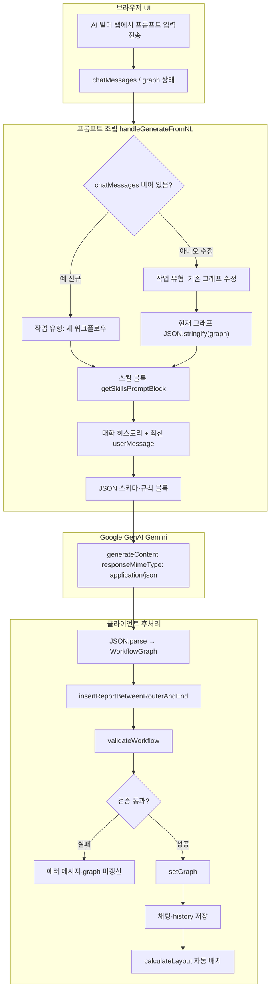
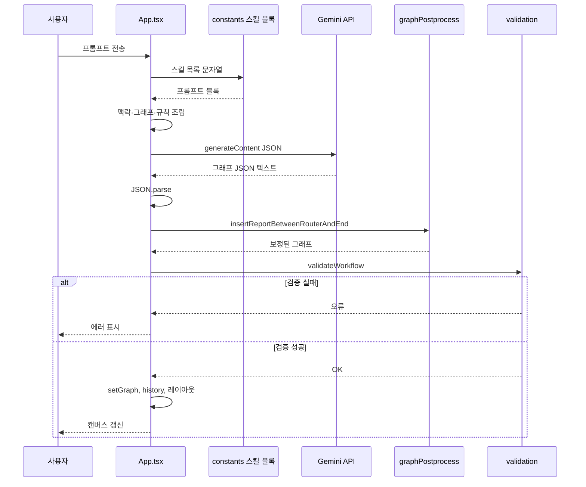
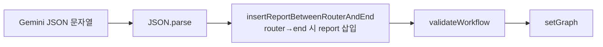
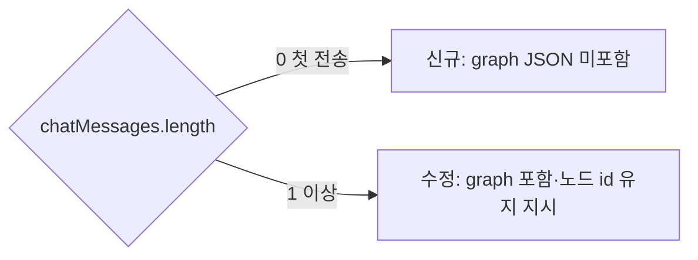

# 동작 흐름 모식도 (Flow)

[← 목차로](./README.md)

아래 다이어그램은 `handleGenerateFromNL` 기준 동작이다. GitHub·VS Code·Cursor 등에서 Mermaid를 렌더링하면 볼 수 있다.

---

## 1. 전체 파이프라인 (사용자 입력 → 캔버스 반영)

---

## 2. 시퀀스 (컴포넌트 간 메시지)

---

## 3. 응답 문자열 처리 (한 줄 파이프라인)

---

## 4. 신규 생성 vs 수정 (분기만)

---

다음: [개요](./01-overview.md)
