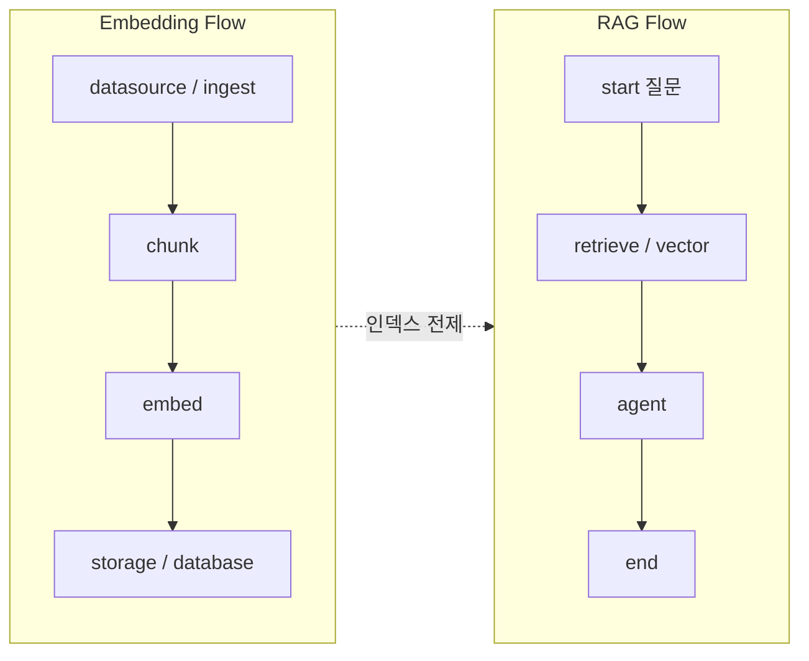

# RAG(검색 증강 생성) in AgentFlow

RAG **챗봇**처럼 쓰려면 흐름이 **둘**로 나뉘는 것이 자연스럽습니다.

| Flow | 역할 | 문서 |
|------|------|------|
| **Embedding Flow** | 문서·규정집 → 청크 → 임베딩 → 저장 (**인덱싱**) | [01-embedding-flow.md](./01-embedding-flow.md) |
| **RAG Flow** | 사용자 질문 → 검색 → 근거 답변 (**질의·답변**) | [02-rag-query-flow.md](./02-rag-query-flow.md) |

스킬 ID: `rag_embedding_flow`, `rag_query_flow` (`src/constants.ts`의 `SKILLS_REGISTRY`).

## 필요한 구성 요소 (요약)

| 구성 | 역할 | 노드·스킬 |
|------|------|-----------|
| 원문 확보 | 파일·텍스트 로드 | `datasource`, `ingest` — `data_import`, `rag_document_load` |
| 청킹·임베딩 | 검색 단위로 쪼개 벡터화 | `chunk`, `embed` — `rag_chunk_embed_index` |
| 벡터 저장 | 인덱스 영속 | `storage`, `database` |
| 검색 | 질의와 유사 청크 | `retrieve`, `vector` — `rag_semantic_fetch` |
| 답변 생성 | 근거만 사용 | `agent` — `rag_grounded_answer`, `nlp` |

## 청킹 전략 (LangChain)

`chunk` 노드 — `src/lib/chunkStrategies.ts`: `recursive`, `fixed`, `markdown`, `semantic`, `hybrid`, `token`. `chunkSize`, `chunkOverlap`은 노드 패널에서 설정.

## Langfuse

`src/lib/langfuseTrace.ts` — 선택. `VITE_LANGFUSE_PUBLIC_KEY` + `VITE_LANGFUSE_SECRET_KEY`.

## 스킬 ID

AI 빌더에는 `getSkillsPromptBlock()`으로 주입됩니다.
